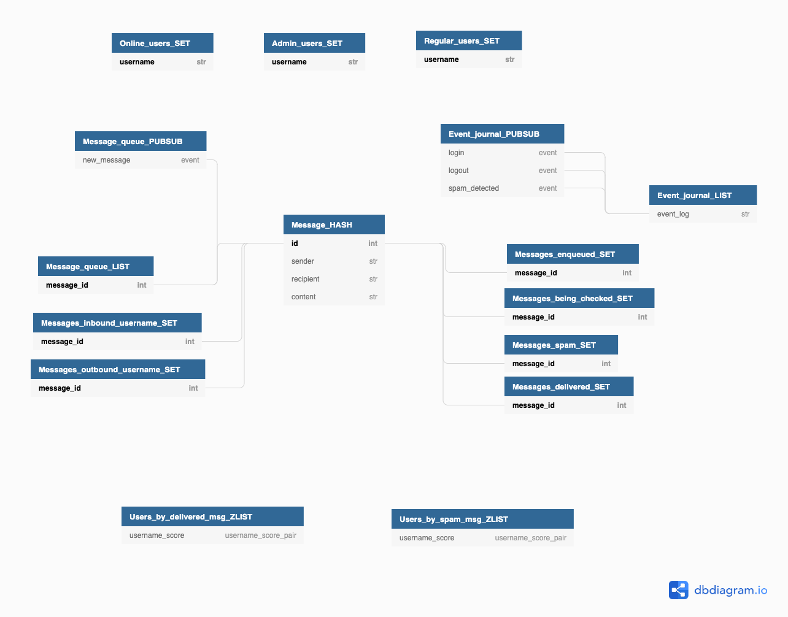

## Intro
A simple messaging app built with Flask and Redis.

## Pre-requisites
You should have [poetry](https://python-poetry.org/) installed.

[Installing Redis](https://gist.github.com/tomysmile/1b8a321e7c58499ef9f9441b2faa0aa8)

## Quickstart
```
poetry install
python3 app.py
```
After the Flask app is launched you should be able to [call the API](#calling-the-api)

## Redis Schema
[DB Diagram](https://dbdiagram.io/d/6040b727fcdcb6230b228eda)


**SET** - Used to store unique, unordered, unstructured data. We use it for storing usernames, inbound/outbound message ids and message statuses for
easy lookup via intersection.

**HASH** - Used to store key-value pairs, where value is usually an object representing a data structure and the key is
its id. We use it to store messages.

**LIST** - A double-ended queue. We use it for in-order processing of messages, where new messages are pushed to the end
of the queue and processed by the worker via popping from the top of the queue. Also used to store event logs, where we 
always push the latest event to the top of the queue.

**ZLIST** - Allows storing key-score pairs, ordered by the score. We use it to identify most active and most spammy
users. In our case key is the username and score is the number of delivered/spam messages.

**PUB/SUB** - Enables MSMC channel (multiple sender and multiple consumer). We use separate threads to subscribe workers
to the `event_journal` and `message_queue` channels. Then upon the `publish` event the `message_queue` worker pops a message
from the queue, spam checks and sends it. Upon `publish` to `event_journal` channel we persist the log message in the
`event_journal_list`.


## Calling the API
If you're a Mac user and have [Paw](https://paw.cloud/), you can use `lab2.paw`.

Unfortunately I didn't have time to setup proper API docs with an OpenAPI page.

Here are some CURL commands you can run to invoke the API:

#### Login
```
curl -X "POST" "http://localhost:5000/login" \
     -H 'Content-Type: application/json; charset=utf-8' \
     -d $'{
  "username": "flain1"
}'
```
#### Logout
```
curl -X "POST" "http://localhost:5000/logout" \
     -H 'Content-Type: application/json; charset=utf-8' \
     -d $'{
  "username": "flain1"
}'
```
#### Send message
```
curl -X "POST" "http://localhost:5000/message" \
     -H 'Content-Type: application/json; charset=utf-8' \
     -d $'{
  "content": "My message",
  "recipient": "Ilya",
  "sender": "flain1"
}'
```
#### Send reply
```
curl -X "POST" "http://localhost:5000/message" \
     -H 'Content-Type: application/json; charset=utf-8' \
     -d $'{
  "content": "My reply",
  "recipient": "flain1",
  "sender": "Ilya"
}'
```
#### Fetch user's message stats
```
curl "http://localhost:5000/user-stats?username=Dizzzmas"
```
#### Fetch user's inbound messages
```
curl "http://localhost:5000/inbound-messages?username=flain1" \
     -H 'Content-Type: application/json; charset=utf-8' \
     -d $'{}'
```
#### Fetch spammers stats
```
curl "http://localhost:5000/spammer-stats"
```
#### Fetch chatter stats
```
curl "http://localhost:5000/chatter-stats"
```
#### Fetch online users
```
curl "http://localhost:5000/online-users"
```
#### Fetch event journal
```
curl "http://localhost:5000/event-journal"
```